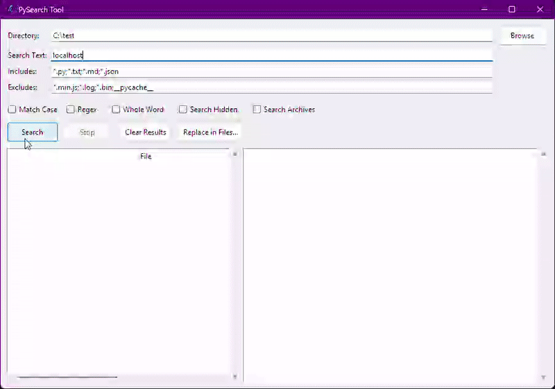

# PySearch Tool

A lightweight, multi-threaded file search and replace utility built with Python. 

Designed as a dependency-free alternative to heavy IDEs for recursive text searching across large codebases and archives.


##  Features

*   **Recursive Search:** Scans directories with glob filtering (include/exclude patterns).
*   **Archive Support:** Seamlessly searches inside `.zip`, `.tar.gz`, and `.tgz` files without extraction.
*   **Multi-threaded:** Uses `threading` and `queue` for responsive UI during heavy I/O.
*   **Safe Replace:** Atomic file writes and automatic `.bak` backups prevent data corruption.
*   **Diff Preview:** integrated diff viewer to review changes before applying them.
*   **Zero Dependencies:** Runs on standard Python. No `pip install` required.


## Installation
No installation required. Ensure you have Python 3.8 or higher installed.
Simply clone the repository and run the `main.py` script.


## Usage



To start using PySearch, run the following command in your terminal:

```bash
python main.py
```
This will launch the PySearch GUI.
From there, you can specify search parameters, file patterns, and perform search/replace operations.

## License
This project is licensed under the MIT License. See the [LICENSE](LICENSE) file for details